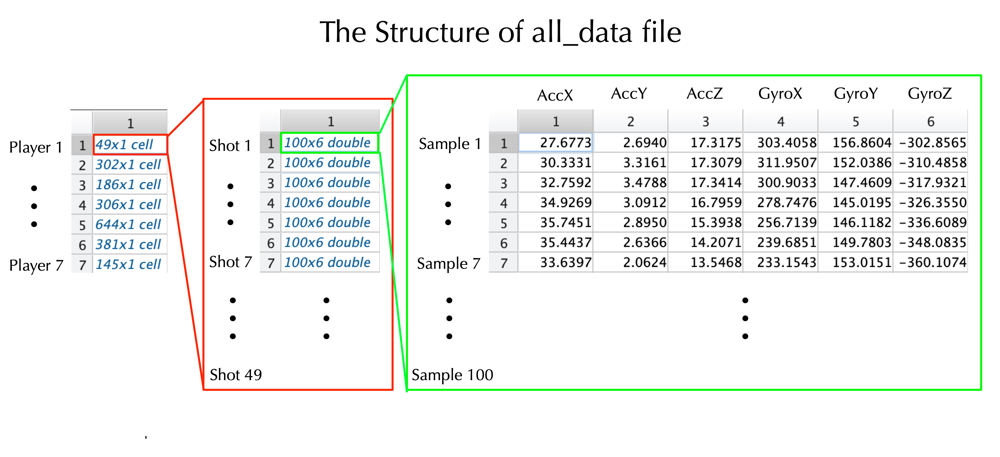
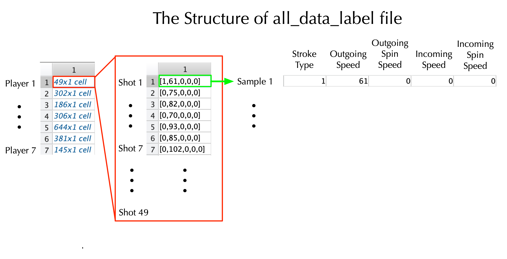

## TennisEye Overview

TennisEye is a tennis ball speed calculation system. It is the first research publication to calculate the serve, groundstroke and volley speed of a tennis ball using a racket mounted motion sensor.

## Data Collection

The motion sensor we used is a [UG sensor](https://ubibrothers.wordpress.com/). It includes a triaxial acceleration sensor and a triaxial gyroscope. The measure range of the accelerometer and the gyroscope were set to be ± 16g and ± 2000◦/sec, respectively. Both sensors were sampled with 100 Hz. The UG sensor was fixed at the handle of the players’ rackets. Fig. 2 shows the sensor position and the coordinate system. We collected data in a tennis court that was equipped with a [PlaySight system](https://playsight.com/), which included six high definition (HD) cameras. The PlaySight system uses image processing algorithm to recognize stroke type, ball speed, and spin speed. 

We collected data from 7 players. Based on their self-report information, we divided the subjects into three categories: coach, regular player, and casual player. The coaches play several times per week, the regular players play one time per week, and the casual players play 0∼2 times per month. In total, we collected 569 serves, 1398 groundstrokes, and 18 volleys. The summary of the tennis dataset is shown below:

## Data Set

new_data_all_7.mat is the tennis data set. It includes two files: all_data and all_data_label. all_data file includes the motion sensor data for each shot. all_data_label file includes the stroke types, outgoing ball speed, outgoing ball spin speed, incoming ball speed, and incoming ball spin speed for each shot. The structure of all_data file is shown in . The structure of all_data_label file is shown in .

## Files
This repository contains the following files. You agree to the [Terms of Use for TennisEye Dataset](#terms-of-use-for-tenniseye-dataset) to download and use the files.

| Files | Description |
| ----- | ----------- |
| new_data_all_7.mat | tennis data set. |
| evaluation_serve_LOSO_regression.m | leave-one-subject-out cross validation of our proposed regression model to calculate serve speed. |

| evaluation_shots_LOSO_physical | leave-one-subject-out cross validation of our proposed physical model to calculate groundstroke/volley ball speed. |
| evaluation_shots_LOSO_regression | leave-one-subject-out cross validation of our proposed regression model to calculate groundstroke/volley ball speed. |
| find_begin_and_end_index | the function to calculate the start and end time of impact process. |
| two_side_interpolation_gy | the function to interpolate the gyroscope readings in Y-axis if saturation happens. |

## Terms of Use for TennisEye Dataset

You need to read and agree to the following terms of use to download and use the TennisEye dataset.

>`1. Definitions`
>
>The following terms, unless the context requires otherwise, have the following meanings:
>
>“Data Team”: means the employees and students at the College of William and Mary who are working on the TennisEye dataset;
>
>“TennisEye Dataset”: means the tennis data collected by the Data Team;
>
>“Licensee”, “You”, “Your”, “Yours”: means the person or entity acquiring a license hereunder for access to and use of the TennisEye Dataset.

>
>`2. Grant of License`
>
>The College of William and Mary hereby grants to You a non-exclusive, non-transferable, revocable license to use the TennisEye Dataset solely for Your non-commercial, educational, and research purposes only, but without any right to copy or reproduce, publish or otherwise make available to the public or communicate to the public, sell, rent or lend the whole or any constituent part of the TennisEye Dataset thereof. The TennisEye Dataset shall not be redistributed without the express written prior approval of the College of William and Mary You agree to respect the privacy of those human subjects whose sign gesture data are included in the TennisEye Dataset. Do not attempt to reverse the anonymization process to identify specific identifiers including, without limitation, names, postal address information, telephone numbers, e-mail addresses, social security numbers, and biometric identifiers. You agree not to reverse engineer, separate or otherwise tamper with the TennisEye Dataset so that data can be extracted and used outside the scope of that permitted in this Agreement.
>
>You agree to acknowledge the source of the TennisEye Dataset in all of Your publications and presentations based wholly or in part on the TennisEye Dataset. You agree to provide a disclaimer in any publication or presentation to the effect that the College of William and Mary does not bear any responsibility for Your analysis or interpretation of TennisEye Dataset.
>
>You agree and acknowledge that the College of William and Mary may hold, process, and store any personal data submitted by You for validation and statistical purposes and for the purposes of the administration and management of TennisEye Dataset. You agree that any personal data submitted by You is accurate to the best of his or her knowledge.
>
>The College of William and Mary provides the TennisEye Dataset "AS IS," without any warranty or promise of technical support, and disclaims any liability of any kind for any damages whatsoever resulting from use of the TennisEye Dataset .
>
>THE COLLLEGE OF WILLIAM AND MARY MAKES NO WARRANTIES, EXPRESS OR IMPLIED WITH RESPECT TO THE SIGNFI DATASET, INCLUDING ANY IMPLIED WARRANTY OF MERCHANTABILITY OR FITNESS FOR A PARTICULAR PURPOSE, WHICH ARE HEREBY EXPRESSLY DISCLAIMED.
>
>Your acceptance and use of the TennisEye Dataset binds you to the terms and conditions of this License as stated herein.
